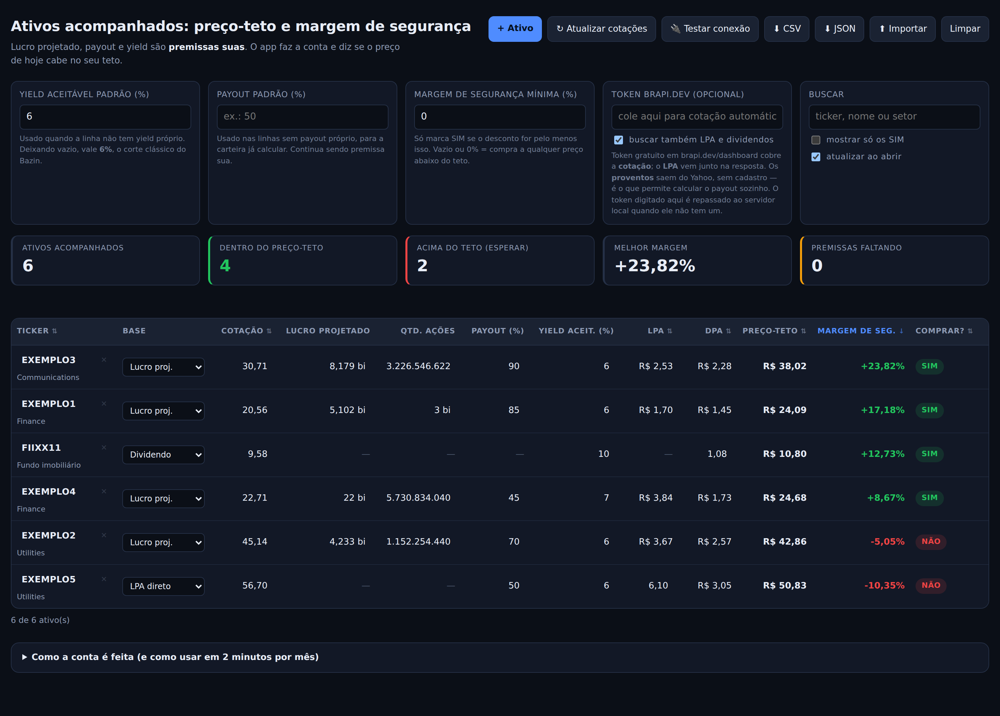

# Preço-teto e margem de segurança (B3)

Ferramenta de uso próprio para responder, em poucos minutos por mês, uma pergunta só:
**o preço de hoje está abaixo do preço máximo que eu aceito pagar por esse ativo?**

Duas formas de rodar, sem build e sem dependência:

```bash
npm start   # http://localhost:8787 — recomendado: cotação automática funciona
```

ou abra o `index.html` direto no navegador (duplo clique), que faz tudo menos a
busca automática de cotações. Em ambos os casos os dados ficam salvos na sua
máquina, no `localStorage` do navegador.

O `npm start` sobe `tools/servidor.mjs`, que entrega o app **e** consulta a brapi
pelo lado do servidor. Isso existe por um motivo concreto: chamada à brapi feita
de dentro do navegador é barrada por CORS quando a página vem de `file://` e
também na página publicada como artifact, que não tem permissão de rede. Do
servidor, a chamada sai normalmente — e o token fica na variável de ambiente, sem
nunca chegar ao navegador:

```bash
BRAPI_TOKEN=seu_token BOLSAI_KEY=sua_chave npm start
```

Se você subir o servidor **sem** `BRAPI_TOKEN`, o token digitado no campo da tela é
repassado ao servidor local (mesma máquina, e sem isso ele seria ignorado). O token
do servidor sempre tem precedência, e nenhum dos dois é registrado no log.



## A conta

| Passo | Fórmula | Exemplo |
| --- | --- | --- |
| LPA (lucro por ação) | lucro projetado ÷ quantidade de ações | 4,233 bi ÷ 1.152.254.440 = **R$ 3,67** |
| DPA (dividendo por ação) | LPA × payout | 3,67 × 70% = **R$ 2,57** |
| Preço-teto | DPA ÷ yield aceitável | 2,57 ÷ 6% = **R$ 42,86** |
| Margem de segurança | (preço-teto ÷ cotação) − 1 | 42,86 ÷ 45,14 − 1 = **−5,05%** |
| Comprar? | margem ≥ margem mínima exigida | −5,05% < 0% → **NÃO** |

Enquanto faltar premissa, o selo da última coluna diz **qual** campo preencher
(`falta payout`, `falta LPA + payout`, `falta DPA`). E o painel de diagnóstico
mostra a versão servida (`código <sha> · <branch>`), que é a forma rápida de
confirmar se o `git pull` pegou.

### Abrir já é atualizar

Com o app servido por `npm start` (ou com token no campo), abrir a página dispara a
atualização sozinha — a tabela aparece com o preço de hoje, sem clique. A caixa
**atualizar ao abrir** desliga esse comportamento, e a página publicada nunca tenta
(sem servidor e sem token, não há por onde consultar).

Para a carteira fechar a conta de uma vez, use o **payout padrão**: ele vale nas
linhas sem payout próprio, do mesmo jeito que o yield aceitável padrão. Preço e LPA
vêm da API, o payout vem desse campo, e todas as linhas passam a ter preço-teto e
veredito. Continua sendo premissa sua — só deixou de ser uma premissa por linha.

### O que a atualização automática traz — e o que não traz

| Campo | Vem sozinho? |
| --- | --- |
| Cotação | ✅ sempre |
| Nome e setor | ✅ sempre |
| LPA | ✅ quando a brapi devolve `earningsPerShare` na resposta comum (acontece sem plano pago); senão, com `BOLSAI_KEY` |
| DPA de 12 meses | ✅ pela brapi v2 (`/stocks/dividends` ou `/fii/dividends`), ou pela bolsai |
| Payout | ❌ nunca vem de API — mas o **payout padrão** preenche todas as linhas de uma vez |
| Lucro projetado e nº de ações | ❌ nunca — premissa sua |

Ou seja: depois de atualizar as cotações, as linhas continuam em `falta payout`
até você informar o payout de cada ativo. Isso é de propósito — payout é a sua
leitura de quanto a empresa vai distribuir, não um dado de mercado.

É o método de Décio Bazin: se o dividendo esperado por ação não paga o yield
que você exige, o papel está caro para você — por melhor que a empresa seja.

### Três formas de chegar ao dividendo

Escolha por ativo, na coluna **Base**:

- **Lucro projetado** — lucro do ano + quantidade de ações + payout. É o caminho
  mais trabalhoso e o mais transparente: cada premissa fica à vista.
- **LPA direto** — você já tem o lucro por ação; informe LPA e payout. O botão
  *Atualizar cotações* preenche o LPA (últimos 12 meses) automaticamente.
- **Dividendo (DPA)** — informe o provento anual direto. É o modo indicado para
  FIIs (dividendo mensal × 12) e mostra o payout implícito quando há LPA.

### Os dois botões de decisão

- **Yield aceitável padrão** — o retorno em dividendos que você exige. 6% a.a. é o
  corte clássico do Bazin; use valores próprios por ativo quando o risco mudar.
- **Margem de segurança mínima** — exige um desconto adicional sobre o teto.
  Com 20%, um ativo de teto R$ 110 só recebe **SIM** abaixo de R$ 91,67
  (o app mostra esse "pagar até" embaixo do preço-teto).

## Rotina mensal sugerida

1. Clique em **↻ Atualizar cotações** (preço, setor e LPA vêm da [brapi.dev](https://brapi.dev)).
2. Revise payout e lucro projetado dos ativos que divulgaram balanço no mês.
3. Ordene pela coluna **Margem de seg.** e marque *mostrar só os SIM*.
4. Exporte o **CSV** se quiser guardar o histórico da decisão daquele mês.

## Cotação automática

A busca acontece no seu navegador, direto na [brapi.dev](https://brapi.dev). O que
cada plano cobre muda o que o botão consegue preencher:

| Dado | Plano gratuito da brapi |
| --- | --- |
| Cotação | ✅ sim (15.000 requisições/mês, com token) |
| Nome e setor | ✅ sim |
| LPA (`defaultKeyStatistics`) | ❌ plano pago |
| Histórico de dividendos | ❌ plano pago |
| Tudo, em PETR4, MGLU3, VALE3 e ITUB4 | ✅ sim, e sem token — servem para testar |

Por isso a caixa **buscar também LPA e dividendos** vem desmarcada. Quando marcada e
o plano não cobrir, o app **refaz a chamada só com o preço**, atualiza a cotação e
avisa na tela — pedir módulo pago derrubaria a requisição inteira, cotação incluída.

Regras da atualização automática:

- a **cotação** é sempre sobrescrita (é dado de mercado);
- **LPA, DPA, nome e setor** só são preenchidos se o campo estiver vazio — uma
  premissa sua nunca é apagada pela API;
- tickers fora do padrão da B3 (`PETR4`, `TAEE11`) são ignorados na consulta,
  então a linha `EXEMPLO` não gera erro.

Sem token, sem internet ou fora do horário de mercado, digite o preço à mão: o
campo *Cotação* é editável e a etiqueta `auto` desaparece quando você edita.

Se preferir o terminal, exporte o JSON e rode:

```bash
node tools/atualizar-cotacoes.mjs carteira-preco-teto-2026-09-17.json --token SEU_TOKEN
# com fundamentos (plano pago): acrescente --fundamentos
# ou: BRAPI_TOKEN=... node tools/atualizar-cotacoes.mjs carteira.json
```

Depois importe o arquivo de volta pelo botão **⬆ Importar**.

## Não está atualizando? Rode o diagnóstico

O botão **🔌 Testar conexão** faz quatro chamadas e diz exatamente onde parou
(o token nunca aparece no relatório):

| Etapa | O que isola |
| --- | --- |
| Servidor local | se o app vem do `npm start`, e se tem `BRAPI_TOKEN` e `BOLSAI_KEY` |
| Rede: PETR4 sem token | se a chamada consegue sair do navegador |
| Token na URL (`?token=`) | se o token é aceito como parâmetro |
| Token no header (`Bearer`) | se o token é aceito como cabeçalho |
| Fundamentos | se o plano cobre LPA e dividendos — testado em **um ticker seu**, nunca em PETR4: a brapi libera PETR4/MGLU3/VALE3/ITUB4 por completo e o resultado daria falso positivo |
| v2: cotação e fundamentos | a brapi também tem uma API v2 (`/api/v2/stocks/quote?symbols=…`), com rotas separadas. O app usa a v1; a sonda mostra o que a v2 serve no seu plano, porque o recorte pago pode ser diferente |

Causas mais comuns, em ordem:

1. **🚫 na linha de rede: o navegador barrou a chamada antes de sair.** Acontece na
   página publicada (as capacidades de um artifact são `artifact`, `assets`,
   `comments`, `db`, `downloads`, `mcp`, `room`, `sample`, `self` e `user` —
   **nenhuma é acesso HTTP livre**) e também com `file://`, quando o CORS da API
   recusa a origem. **Solução:** `npm start` e abra `http://localhost:8787`; aí a
   consulta sai do servidor e o app mostra "via servidor local" no status.
2. **Forma de autenticação.** A brapi documenta `Authorization: Bearer SEU_TOKEN`,
   mas o parâmetro `?token=` também funciona e não dispara preflight de CORS. O app
   tenta a URL primeiro e, se levar 401, **repete a chamada com o header** — e avisa
   qual caminho funcionou.
3. **Plano sem fundamentos.** HTTP 403 só na quarta etapa: cotação atualiza, LPA e
   dividendos não.
4. **HTTP 400 (ou 403) ao atualizar vários ativos.** O plano gratuito da brapi aceita
   **um ticker por requisição**; o app detecta a recusa do lote e passa a consultar um
   a um, avisando na tela. Um ticker sozinho funcionar enquanto a lista inteira falha
   é a assinatura desse caso. Quando o plano também recusa os módulos pagos, as duas
   quedas se compõem: consulta individual **e** sem módulos, com o 403 descoberto uma
   única vez para não repetir a tentativa paga em cada ticker.
5. **Servidor local sem token.** O diagnóstico mostra `✅ Servidor local … sem
   BRAPI_TOKEN` e *respondeu sem dados*: fora de PETR4/MGLU3/VALE3/ITUB4 a brapi
   exige token. Basta deixar o token no campo da tela (o app repassa) ou reiniciar
   com `BRAPI_TOKEN=... npm start`.
6. **Um ticker específico com 404.** Pode ser código extinto (CPLE6 virou CPLE3 na
   migração da Copel ao Novo Mercado, em 10/11/2025) ou papel que existe numa versão
   da API e não na outra. Quando as duas falham, o app busca códigos parecidos em
   `/api/quote/list?search=` e sugere na própria mensagem: *"A brapi tem: CPLE3,
   CPLE5."* O servidor tenta a outra versão só para os tickers que falharam,
   avisa quando recupera (`CPLE6 não veio na v1 e foi buscado na v2`) e, quando as
   duas falham, o erro da linha cita as duas. Para investigar um ticker específico:

   ```bash
   BRAPI_TOKEN=seu_token npm run ticker -- CPLE6
   ```

   O comando mostra o que cada rota responde (v1, v1 com módulos, v2, dividendos de
   ação e de FII). 404 em todas = a brapi não tem esse código; 403 = a rota existe,
   mas seu plano não a cobre; **401 em todas** = o token do ambiente está sendo
   recusado, e aí o próprio comando repete a consulta num ticker livre sem token
   para provar que o problema é a chave, não o ticker.
7. **Ticker fora do padrão da B3.** Só `AAAA9`/`AAAA11` entram na consulta; a linha
   `EXEMPLO` é ignorada de propósito.

Se o servidor local não trouxer nada, o app tenta a consulta direto do navegador
antes de desistir, e o status diz qual caminho funcionou.

## Quais rotas da brapi v2 este projeto usa

A v2 tem rota por classe de ativo. A carteira só precisa de **cotação** e
**provento anual por ação**, então usa três:

| Rota | Uso aqui |
| --- | --- |
| `/v2/stocks/quote` | cotação, nome e setor das ações |
| `/v2/stocks/dividends` | dividendos e JCP → DPA dos últimos 12 meses |
| `/v2/fii/dividends` | o mesmo, para FII (tentada quando a rota de ações não traz evento) |
| `/v2/stocks/historical`, `/v2/fii/historical` | não usadas — o app não faz gráfico nem backtest |
| `/v2/fii/indicators` | não usada — DY e P/VP vêm em escala ambígua; DPA em reais é direto |
| `/v2/funds/*`, `/v2/options/*`, `/v2/futures/*`, `/v2/treasury/*`, `/v2/currency/*` | fora do escopo: a ferramenta cobre ações e FII |

O app não precisa saber de antemão se o ticker é ação ou FII: consulta
`/stocks/dividends` e, se não houver evento (ou vier 404), repete em
`/fii/dividends`. A resposta registra qual rota respondeu (`fonteProventos`).

## API v2 da brapi

As cotações usam a API v2 (`GET /api/v2/stocks/quote?symbols=B3SA3`), com o token
no header `Authorization: Bearer` — nunca na URL, nunca no navegador. O cliente
está em `assets/brapi-v2.js`, tipado por JSDoc (o projeto é JS puro, sem build):

```js
const { buscarCotacao } = require('./assets/brapi-v2.js');
const dados = await buscarCotacao('B3SA3');   // token: BRAPI_TOKEN do ambiente
// -> results[0].data, já desembrulhado
```

Respostas não-2xx viram `ErroBrapi` com o `status` preservado e mensagem em
português (401 token, 403 plano, 429 limite, 404 ticker, 5xx indisponível);
corpo sem `results`, lista vazia ou item sem dados têm código próprio
(`sem-results`, `lista-vazia`, `sem-dados`) em vez de devolver `undefined`.

Duas decisões de integração:

- **queda para a v1**: se a v2 falhar por qualquer motivo, o servidor repete na v1
  e informa a fonte em `fonte: "v1"`, para a cotação nunca se perder. `BRAPI_V2=0`
  força a v1.
- **fundamentos continuam na v1**: a resposta comum da v1 traz `earningsPerShare`
  na raiz, o que dá LPA sem plano pago. Enquanto a v2 não comprovar o mesmo campo,
  pedir fundamentos usa a v1 — trocar às cegas custaria esse LPA de graça.

## LPA e proventos automáticos (bolsai)

A brapi cobre a **cotação** no plano gratuito, mas não os fundamentos. Para o LPA
vir preenchido, o servidor consulta a [bolsai](https://usebolsai.com) — plano
gratuito de 200 requisições/dia que cobre fundamentos e dividendos, com dados
derivados de CVM e B3:

```bash
BOLSAI_KEY=sua_chave npm start     # chave grátis em usebolsai.com (login Google)
```

| | Origem |
| --- | --- |
| Cotação, nome, setor | brapi v2, com queda para v1 (`BRAPI_TOKEN`) |
| **LPA (TTM)** | bolsai — `GET /fundamentals/{ticker}`, campo `lpa` |
| **DPA de 12 meses** | bolsai — `GET /dividends/{ticker}`, soma dos eventos do período |
| Payout, lucro projetado | você (premissa) |

Com a chave configurada, marque **buscar também LPA e dividendos** e clique em
*Atualizar cotações*: o LPA entra nas linhas em modo *LPA direto* e o DPA nas
linhas em modo *Dividendo*. A caixa desmarcada não gasta requisição nenhuma da
bolsai. A chave fica só no servidor — vai no header `X-API-Key`, nunca na URL,
nunca no navegador, nunca no log.

Sem `BOLSAI_KEY`, o app cai nos módulos da brapi (que exigem plano pago) e avisa
quando são recusados, mantendo a cotação.

### Se o LPA não vier preenchido

A documentação pública da bolsai mistura nomes de campo em português e inglês, então
cada métrica é procurada por uma lista de candidatos (`lpa`, `eps`, `lucro_por_acao`,
`earnings_per_share`, …) e o resultado registra **qual** chave foi usada. Quando
nenhuma casa, o app avisa e você descobre o nome certo com:

```bash
BOLSAI_KEY=sua_chave npm run inspecionar BBAS3
```

O comando imprime os campos recebidos, qual deles foi reconhecido como LPA e um
evento de provento de exemplo. Basta acrescentar o nome correto em
`CANDIDATOS_LPA`, no arquivo `assets/bolsai.js`. A chave nunca é impressa.

## De onde vêm os dados "corretos"

Cada coluna tem um grau diferente de disponibilidade pública:

| Informação | Onde obter | Situação |
| --- | --- | --- |
| Cotação | brapi (grátis), HG Brasil, bolsai | resolvido |
| LPA / lucro dos últimos 12 meses | **bolsai (integrada)**, CVM, brapi pago | resolvido |
| Proventos pagos (12 meses) | **bolsai (integrada)**, CVM, B3 | resolvido |
| Nº de ações | CVM (composição do capital), B3 | disponível, não integrado |
| Payout | derivável: proventos ÷ lucro do mesmo período | calculável, não é campo de API |
| **Lucro projetado** | consenso de analistas (Refinitiv, Bloomberg, corretoras) | **não existe grátis — é premissa sua** |

A fonte primária e gratuita de tudo que é histórico é a própria CVM
([dados.cvm.gov.br](https://dados.cvm.gov.br/dataset/cia_aberta-doc-dfp) — DFP e ITR
em CSV, com lucro líquido e composição do capital). As APIs comerciais desta tabela
são, na prática, essa base da CVM já limpa e indexada por ticker.

O Yahoo Finance não serve para este app: a API é não oficial e exige cookie/crumb,
o que não funciona a partir do navegador ([referência](https://github.com/gadicc/yahoo-finance2/issues/764)).

## Formatos aceitos nos campos

Digite como for mais natural — o app entende formato brasileiro e atalhos de escala:

`5.102.000.000,00` · `5,102 bi` · `22bi` · `340 mi` · `1.152.254.440` · `20,56` · `85%`

## Testes

```bash
npm test          # 173 testes de cálculo, cotação, bolsai, servidor e CLI (node puro)
npm run test:ui   # 94 verificações de interface com Chromium (precisa de playwright-core)
```

Os testes de cálculo conferem as linhas da planilha que serviu de referência,
reproduzindo preço-teto e margem na casa do centavo (−5,05%, +23,82%, +8,67%).

## Publicar (opcional)

Como é só HTML/CSS/JS estático, dá para servir no GitHub Pages: em
*Settings → Pages*, escolha a branch e a pasta raiz. Nenhum dado seu vai para o
repositório — a carteira mora no `localStorage` do navegador.

## Estrutura

```
index.html                    página única
assets/calc.js                LPA, DPA, preço-teto, margem, veredito (testado)
assets/quotes.js              integração com a brapi.dev
assets/app.js                 tabela editável, ordenação, import/export
assets/seed.js                carteira e configuração iniciais
assets/styles.css             tema escuro, responsivo
assets/brapi-v2.js            cliente da API v2 da brapi (cotação e dividendos, header Bearer)
assets/proventos.js           soma de proventos de 12 meses, tolerante ao formato da fonte
assets/bolsai.js              fundamentos (LPA e proventos) pela bolsai
tools/servidor.mjs            servidor local + proxy da brapi e da bolsai (npm start)
tools/inspecionar-bolsai.mjs  mostra a resposta real da bolsai e o campo reconhecido
tools/testar-ticker.mjs       investiga um ticker em todas as rotas da brapi
tools/atualizar-cotacoes.mjs  atualizador de preços por linha de comando
tools/captura.mjs             gera a captura de tela do README
test/                         testes de cálculo, de cotação e de interface
```

## Aviso

Isto é uma calculadora, não uma recomendação de investimento. O resultado vale
exatamente o que valem as premissas que você digitou: lucro projetado, payout e
yield aceitável são escolhas suas, e preço-teto não diz nada sobre a qualidade ou
o risco do negócio.
